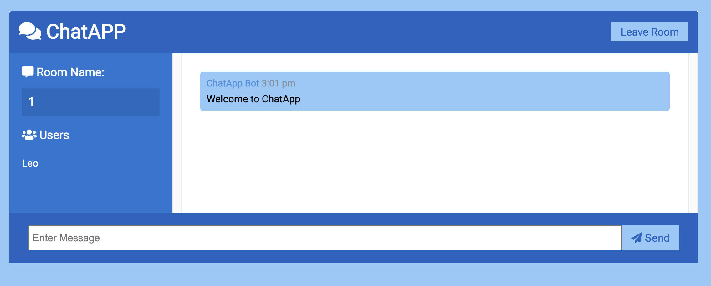
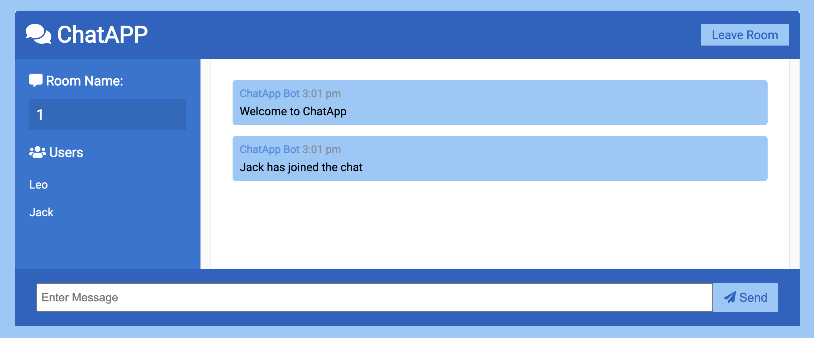
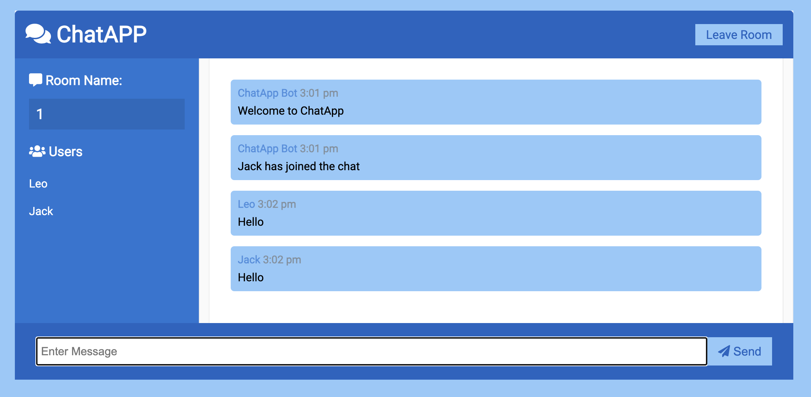

# Real-Time Chat Application

A simple real-time chat application built using **JavaScript**, **Node.js**, **Express.js**, and **Socket.io**.

## Features

- Real-time messaging between multiple users
- Notifications for user connections and disconnections
- Display of active users in the chat room
- Smooth user experience with instant message delivery

## Technologies Used

- **JavaScript**: For client-side scripting.
- **Node.js**: Server-side JavaScript environment.
- **Express.js**: Web framework for building the API.
- **Socket.io**: Enables real-time, bi-directional communication between the server and clients.

## Getting Started

### Prerequisites

Make sure you have the following installed:

- [Node.js](https://nodejs.org/) (version 12 or above)
- npm (comes with Node.js)

### Installation

1. Clone the repository:

   ```bash
   git clone https://github.com/jungchechang/Real-Time-Chat-APP.git
2. Navigate into the project directory:
   ```bash
   cd real-time-chat-app
3. Install the dependencies:
    ```bash
    npm install
4. Start the server:
    ```bash
    npm start
5. Open your browser and navigate to:
    ```bash
    http://localhost:3000

## Screenshot
### Chat Room


### New user joined


### User chatting



